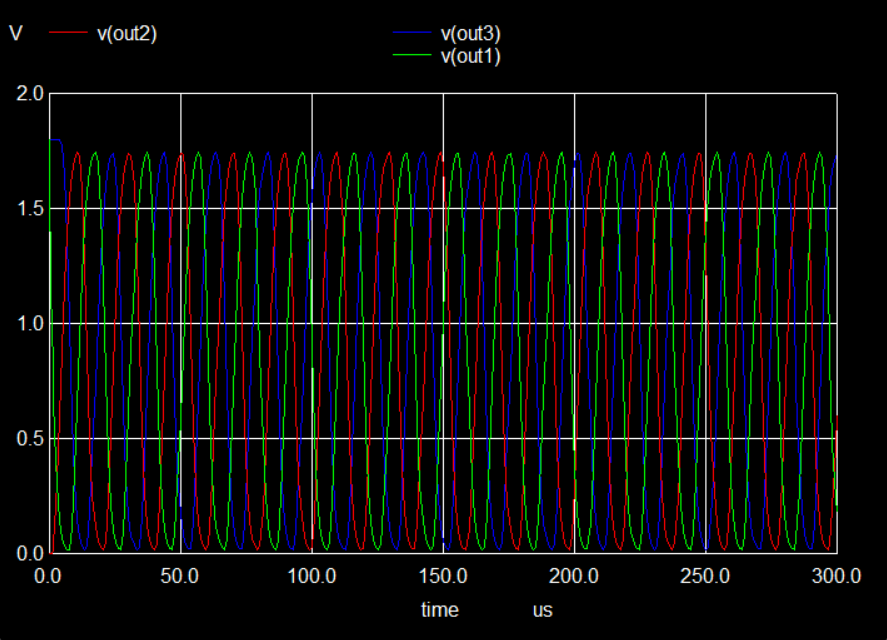
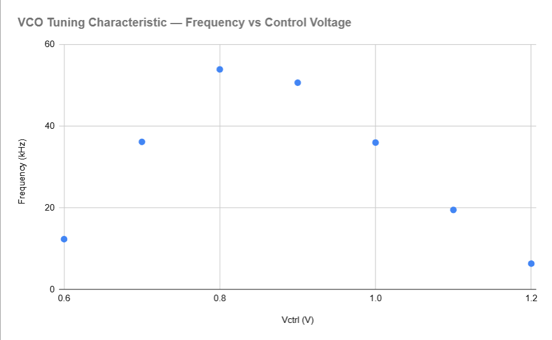
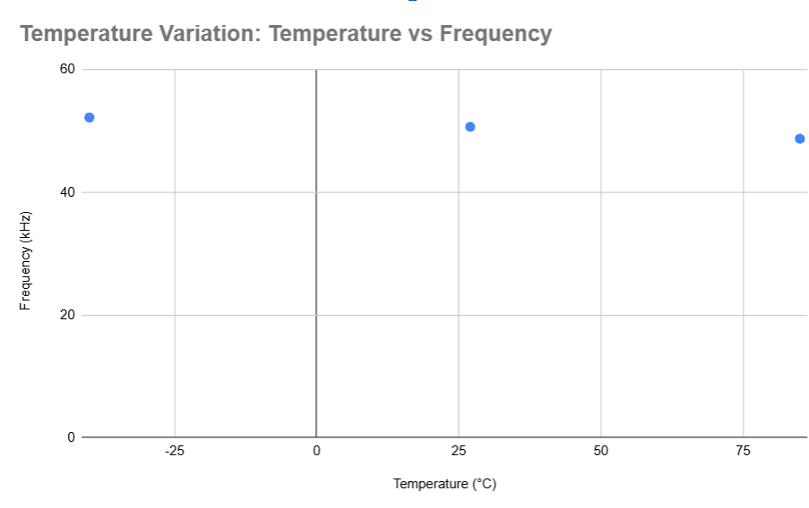
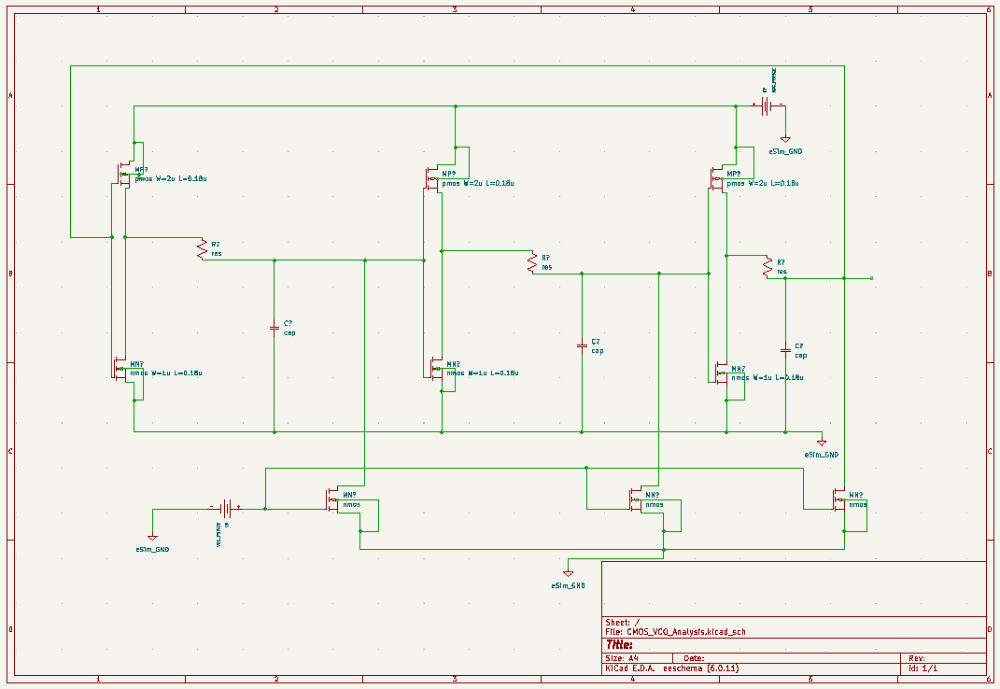

# 3-Stage Current-Starved CMOS Ring Oscillator VCO

> Analog IC simulation of a voltage-controlled ring oscillator targeting
> 50 kHz, implemented in ngspice with current-starved topology.
> Extends prior CMOS VCO design work done in Cadence Virtuoso.

**Author:** Ankit Banerjee | B.Tech ECE | NEHU Shillong  
**Simulator:** ngspice-35 via eSim 2.4 (IIT Bombay)  
**Topology:** Current-starved 3-stage CMOS ring oscillator  
**Target frequency:** 40–55 kHz at Vctrl = 0.9V

---

## Table of Contents
- [Overview](#overview)
- [Circuit Topology](#circuit-topology)
- [Files](#files)
- [Simulation Results](#simulation-results)
- [How to Run](#how-to-run)
- [Code Explanation](#code-explanation)
- [Connection to Prior Work](#connection-to-prior-work)

---

## Overview

A Voltage-Controlled Oscillator (VCO) is a circuit whose output frequency
is controlled by an input voltage. VCOs are the core component of
Phase-Locked Loops (PLLs) — used in every clock generation circuit,
wireless transceiver, and processor in modern electronics.

This project simulates a 3-stage current-starved ring oscillator VCO in
ngspice, analysing its frequency-vs-voltage tuning characteristic and
temperature stability across the -40°C to +85°C industrial operating range.

---

## Circuit Topology

Three CMOS inverter stages connected in a ring, each with current-starving
transistors above (PMOS) and below (NMOS) the inverter — both controlled
by the same Vctrl node.

```
        VDD (1.8V)
           |
    MPS (PMOS, W=8u — current source, gate=Vctrl)
           |
           |--- vdd_s (floating supply node)
           |
    MP  (PMOS, W=3u  — inverter pull-up, gate=input)
           |
           |--- out (stage output)
           |
    MN  (NMOS, W=1.5u — inverter pull-down, gate=input)
           |
           |--- gnd_s (floating ground node)
           |
    MNS (NMOS, W=10u — current source, gate=Vctrl)
           |
          GND
```

Stage output → 390Ω resistor → 1nF capacitor → next stage input.
Stage 3 output feeds back to Stage 1 input (ring closure).

**Key parameters:**

| Component | Value |
|-----------|-------|
| Supply voltage (VDD) | 1.8V |
| PMOS inverter | W=3µm, L=0.18µm |
| NMOS inverter | W=1.5µm, L=0.18µm |
| PMOS current source (MPS) | W=8µm, L=0.18µm |
| NMOS current source (MNS) | W=10µm, L=0.18µm |
| RC delay per stage | R=390Ω, C=1nF |
| NMOS threshold voltage | 0.5V |
| PMOS threshold voltage | -0.5V |

**Why three stages?**
A ring oscillator needs an odd number of inverting stages. With 3 stages,
the signal passes through 3 inversions per loop — emerging inverted.
The circuit continuously tries to correct this inversion, and in doing so,
oscillates. Two stages (even) → stable state, no oscillation.

**How Vctrl controls frequency:**
- Low Vctrl → NMOS starving transistor barely conducts → slow → lower frequency
- High Vctrl → PMOS starving transistor turns off → limited current → lower frequency
- Optimal Vctrl (~0.8–0.9V) → both sources balanced → maximum frequency
- Result: bell-shaped tuning curve — a defining feature of symmetric current-starved topologies

---

## Files

| File | Description |
|------|-------------|
| [spice/vco.cir](spice/vco.cir) | Complete ngspice netlist — oscillation, Vctrl sweep, temperature analysis |

---

## Simulation Results

### Oscillation Waveform (Vctrl = 0.9V)

Three stages oscillating with **120° phase shift** — the defining signature
of a 3-stage ring oscillator. Nominal frequency ≈ 50 kHz.



*V(out1), V(out2), V(out3) shown. Each stage is offset by exactly
one-third of the oscillation period (≈ 6.7µs at 50 kHz).*

---

### VCO Tuning Characteristic — Frequency vs Vctrl

The bell-shaped curve arises because Vctrl simultaneously controls both
PMOS and NMOS current sources in opposing directions. Peak frequency
occurs at the optimal balance point (~0.8V).



| Vctrl (V) | Frequency (kHz) | Notes |
|-----------|-----------------|-------|
| 0.6 | 12.34 | NMOS barely conducting |
| 0.7 | 36.18 | Rising slope |
| 0.8 | 53.94 | **Peak frequency** |
| 0.9 | 50.68 | Nominal operating point |
| 1.0 | 36.01 | Falling slope |
| 1.1 | 19.51 | PMOS entering triode |
| 1.2 | 6.35 | Low current, slow oscillation |

**Observation:** Above Vctrl ≈ 0.8V, the PMOS current source enters triode
region and limits available current despite NMOS being strongly on.
Below Vctrl ≈ 0.8V, NMOS current is insufficient. This behaviour is
consistent with published literature on symmetric current-starved VCO topology.

---

### Temperature Variation (Vctrl = 0.9V fixed)



| Temperature (°C) | Frequency (kHz) | Change vs 27°C |
|-----------------|-----------------|----------------|
| -40 | 52.21 | Higher (lower Vth) |
| 27 | 50.68 | Baseline |
| 85 | 48.74 | Lower (reduced mobility) |

**Observation:** Frequency decreases at higher temperature due to reduced
carrier mobility in MOSFET channels — consistent with MOSFET physics.
At -40°C, reduced threshold voltage allows slightly higher drive current
and thus higher frequency.

---

## Circuit Schematic



*Schematic drawn in KiCad via eSim. Three identical stages visible, each
with PMOS/NMOS current-starving transistors and RC delay network.*

---

## How to Run

### Requirements
- eSim 2.4: [esim.fossee.in/downloads](https://esim.fossee.in/downloads) (free, includes ngspice)

### Steps
1. Open eSim → click **Run Ngspice**
2. Browse to `spice/vco.cir` → click **Run**

The simulation runs 3 analyses automatically:
- **Part 1:** Basic oscillation waveform at Vctrl = 0.9V
- **Part 2:** Vctrl parametric sweep (tuning curve data)
- **Part 3:** Temperature variation at -40°C, 27°C, 85°C

Frequency values print in the ngspice console. Waveform window opens automatically.

### Changing Vctrl
To simulate at a different control voltage, open `spice/vco.cir` in a
text editor and change the DC value on this line:

```spice
Vctrl ctrl 0 DC 0.9    ← change 0.9 to any value between 0.5 and 1.3
```

---

## Code Explanation

### Supply and Control Voltage
```spice
VDD vdd 0 DC 1.8       ← 1.8V supply between node 'vdd' and ground (node 0)
Vctrl ctrl 0 DC 0.9   ← control voltage at node 'ctrl'
```

### One Stage (all three are identical in structure)
```spice
MPS1 vdd_s1 ctrl vdd vdd pmos W=8u L=0.18u   ← PMOS current source (top)
MP1  out1 out3r vdd_s1 vdd pmos W=3u L=0.18u ← PMOS inverter
MN1  out1 out3r gnd_s1 0 nmos W=1.5u L=0.18u ← NMOS inverter
MNS1 gnd_s1 ctrl 0 0 nmos W=10u L=0.18u      ← NMOS current source (bottom)
R1   out1 out1r 390                            ← delay resistor
C1   out1r 0 1n                                ← delay capacitor
```

SPICE MOSFET syntax: `M[name] [drain] [gate] [source] [bulk] [type] [W] [L]`

- **MPS1** (gate=ctrl): Vctrl LOW → PMOS strongly ON → more current → faster.
  Vctrl HIGH → PMOS OFF → less current → slower.
- **MP1 + MN1**: standard CMOS inverter. Input HIGH → output LOW. Input LOW → output HIGH.
- **MNS1** (gate=ctrl): Vctrl HIGH → NMOS strongly ON → more current → faster.
  Vctrl LOW → NMOS barely ON → less current → slower.
- **R1, C1**: introduce propagation delay (τ = RC = 390ns per stage).

### Initial Conditions
```spice
.ic V(out1)=1.8 V(out2)=0 V(out3)=1.8
```
Sets alternating high/low starting state to kick the circuit out of DC
equilibrium and start oscillation. Without this, all nodes sit at the
same voltage and the ring never starts.

### Simulation Command
```spice
.tran 1u 5m    ← transient analysis: 1µs step, 5ms total (250 cycles at 50kHz)
```

### Frequency Measurement
```spice
meas tran t1 WHEN V(out1)=0.9 RISE=15   ← time of 15th rising edge at VDD/2
meas tran t2 WHEN V(out1)=0.9 RISE=16   ← time of 16th rising edge
let freq_khz = 1/((t2-t1)*1000)          ← period = t2-t1, f = 1/T, convert to kHz
```

RISE=15 skips the first 14 crossings (startup transient) and measures only
steady-state oscillation for accurate frequency reading.

---

## Connection to Prior Work

This project reproduces and extends a CMOS VCO designed in **Cadence Virtuoso**
as part of a Government of India funded ASIC research project:

> *"Early Stage Identification of Red Spider Mite using ASIC-based Detector"*  
> NEHU Shillong — Department of Electronics and Communication Engineering

My contribution to that project was the design of a 3-stage CMOS ring
oscillator VCO as the timing core of the detector ASIC. The eSim simulation
here uses the same topology and transistor sizing, extended with:
- Parametric Vctrl sweep and tuning curve characterisation
- Temperature variation analysis across industrial range (-40°C to +85°C)
- Power estimation

These analyses were not part of the original Cadence work and represent an
independent extension of the design.

---

*October 2025 · ngspice-35 · eSim 2.4 (IIT Bombay) · Open Source*
